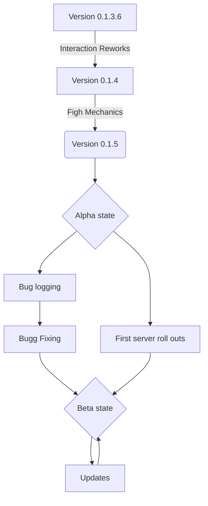

# Open RPG

Hey! This project is an RPG for Discord, where you can easy add new items, reccepies, dungeons, raids, weapons etc. you get the point. It is an Open RPG so the main focus was on expandebilyti and some what on gameplay. Over the next few months i d'like to work more on the fight mechanics and the social side of the bot.

# Usage

You can invite the bot on your server and play imidiatly! After creating a character.
[Invite site](http://google.com/)

## Commands

Since the new Discord polacy changes all commands are now applicationcommands. This means, you invoke a command with ` /commandname subcommandname [kwargs]`. Even though it may seams complicated to you at first glanz, it will provide you with a nice overview of what commands are avaieble and how to use them. And even if you have multyple bots on your server you get distinguan betwean them.

 - List off all commands with
	 - subbcommands

 

## Roadmap

## Whats after the release

After collecting enough feedback and experence what the player want to customice, the plan is to release an standalone game with the data collected. 

### What is the purpose of the discord bot

It is an test phase for how well it is reseaved, how the player interact with the open assets and how much it is used. If the players don't like to create own assets, storys and so on, it was just an year of wasted time instead of multiple years and money.

# Monetisation

The reason why some features are behinde a pay wall are:

 - The server for the bot costs
 - The features behinde a pay wall are only costmetical or have none influence on the gameplay
 - One year is one year even it would make me happy just to see the community grow and use the progamm I created, I have to pay bills and life with something.

## Features behind pay walls

The only feature behinde a pay wall is seting a color for the embeds. You can **edit the colors** of your **caracter embed, inventory embed and your guild embed**.

## Features behind a "soft" pay wall

These features are not exclusive to realworld money but you have the option to pay for it or for the first time it is free. 

 - Character customization
	 - You have **all option while creating an character for free,** but after you created one you can only change it with real world money.
	 - The free option is to delete your character and create a new one.
 - Suggsetion of changes or new things
	 - you can pay for an suggsetion so it will get a **higher priority** than unpayed suggsetions
-	Guild customization
	-	You can only edit your guild **after creation** with **real world money** or delete it and create a new one

# Privacy policy

The bot does not store any of your send messages other than the suggsetions. 
The bot will never ask you about any kind of password.
The bot stores the  discord usernames.
The bot allso stores any channels Id's it created and all guilds.
All Informations about your character will be shown in the game sooner or later. Make shure you will never put personal informations in it without the acceptanse that it will be published.

The creators of the bot are not chargeble for any leaked informations to a third party. 

With inviting the bot to your server you accept the privacy policy.

# Contributans

Contributans are wellcomed! 
Requirements are:
-	Able to work in an team
-	Able to work remote
-	Intermidiate to high level skills in Python and SQL
-	English kowledge
-	Knowledge about the discord API and or about  nextcord V1.6 and above

# Authors and acknowledgment

Authors:
-	[Retro]("https://github.com/Noah-Retro")

Packages used:
-	[Nextcord]("https://github.com/nextcord/nextcord")

# Licens

All rights are by the developers of this programm.
Third partys shall only acces the code with the agreement of the publisher.
To distribute, copy, use for his own or modify this software needs a permition of the creator.
Man just ask if you want to modify it or use in an private menar.

# Ending
Sorry for my horrible english writting.
Have fun with the bot.

With best regards 
Noah-Retro

