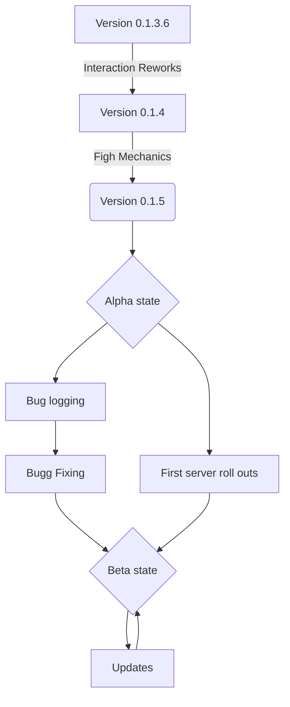

# Open RPG

Hey! This project is an RPG for Discord, where you can easy add new items, reccepies, dungeons, raids, weapons etc. you get the point. It is an Open RPG so the main focus was on expandebilyti and some what on gameplay. Over the next few months i d'like to work more on the fight mechanics and the social side of the bot.

# Usage

You can invite the bot on your server and play imidiatly! After creating a character.
[Invite site](http://google.com/)

## Commands

Since the new Discord polacy changes all commands are now applicationcommands. This means, you invoke a command with ` /commandname subcommandname [kwargs]`. Even though it may seams complicated to you at first glanz, it will provide you with a nice overview of what commands are avaieble and how to use them. And even if you have multyple bots on your server you get distinguan betwean them.

 - List off all commands with
	 - subbcommands

 

## Roadmap

## Whats after the release

After collecting enough feedback and experence what the player want to customice, the plan is to release an standalone game with the data collected. 

### What is the purpose of the discord bot

It is an test phase for how well it is reseaved, how the player interact with the open assets and how much it is used. If the players don't like to create own assets, storys and so on, it was just an year of wasted time instead of multiple years and money.

# Privacy policy

The bot does not store any of your send messages other than the suggsetions. 
The bot will never ask you about any kind of password.
The bot stores the  discord usernames.
The bot allso stores any channels Id's it created and all guilds.
All Informations about your character will be shown in the game sooner or later. Make shure you will never put personal informations in it without the acceptanse that it will be published.

The creators of the bot are not chargeble for any leaked informations to a third party. 

With inviting the bot to your server you accept the privacy policy.

# Contributans

Contributans are wellcomed! 

# Authors and acknowledgment

Authors:
-	[Retro]("https://github.com/Noah-Retro")

Packages used:
-	[Nextcord]("https://github.com/nextcord/nextcord")

# Licens

THE SOFTWARE IS PROVIDED “AS IS”, WITHOUT WARRANTY OF ANY KIND, EXPRESS OR IMPLIED, INCLUDING BUT NOT LIMITED TO THE WARRANTIES OF MERCHANTABILITY, FITNESS FOR A PARTICULAR PURPOSE AND NONINFRINGEMENT. IN NO EVENT SHALL THE AUTHORS OR COPYRIGHT HOLDERS BE LIABLE FOR ANY CLAIM, DAMAGES OR OTHER LIABILITY, WHETHER IN AN ACTION OF CONTRACT, TORT OR OTHERWISE, ARISING FROM, OUT OF OR IN CONNECTION WITH THE SOFTWARE OR THE USE OR OTHER DEALINGS IN THE SOFTWARE.

# Ending
Sorry for my horrible english writting.
Have fun with the bot.

With best regards 
Noah-Retro

